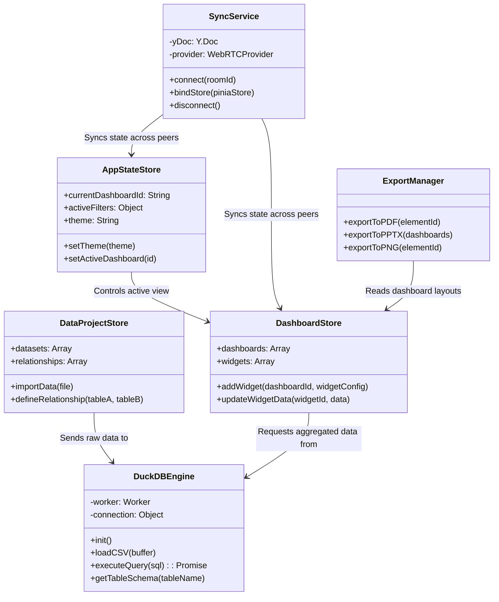
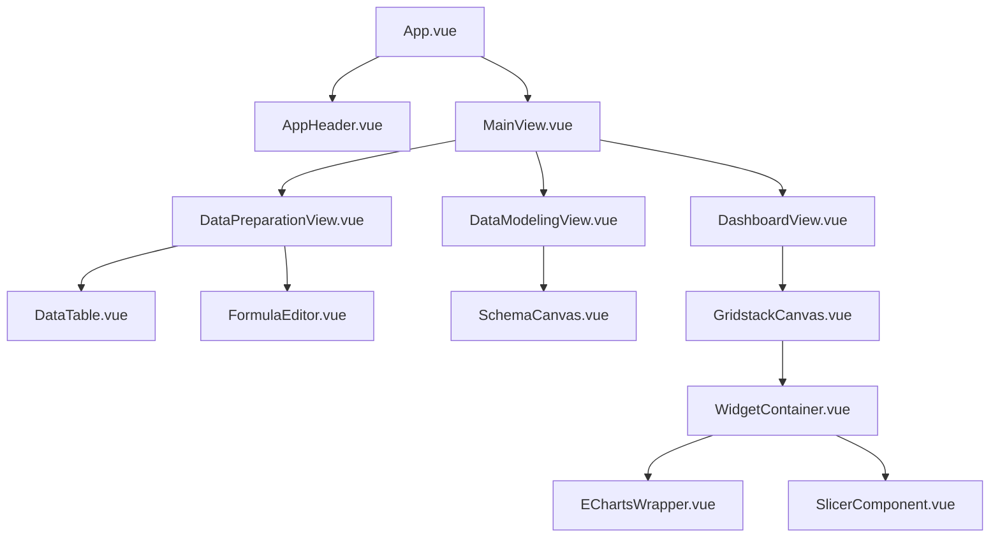

# Class & Module Diagrams

This document illustrates the core logical components of LiteBI and their relationships.

## Core Services & Stores

## UI Component Hierarchy (Simplified)

> **Note:** These diagrams are intended to provide a high-level mental model of the application. For detailed, up-to-date API signatures, always refer to the source code.
