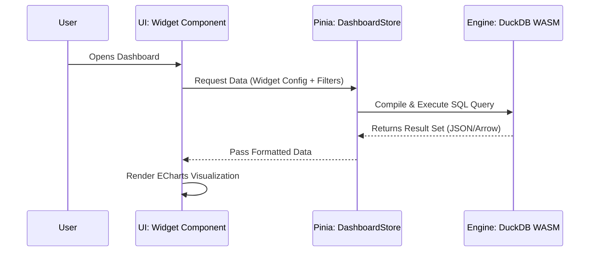

# State Management & Data Flow

Understanding how data moves through LiteBI is critical. The application is highly interactive and relies heavily on local processing.

## 1. Data Ingestion Flow

When a user imports a CSV or Excel file:

1. **UI Layer:** The user drops a file into the import zone.
2. **Parsing:** `PapaParse` (for CSV) or `SheetJS` (for Excel) reads the file in the browser memory.
3. **Engine Layer:** The parsed raw data is sent to the `DuckDBEngine` (WASM). DuckDB creates an internal table.
4. **State Layer:** `DataProjectStore` records the metadata of the new table (name, schema, row count).
5. **Persistence:** `localForage` saves a snapshot of the raw data/DuckDB state to IndexedDB for offline persistence.

## 2. Dashboard Rendering Flow (Querying)

When a user views a dashboard with charts:

## 3. Cross-Filtering Flow

LiteBI supports dynamic cross-filtering (clicking a bar chart filters the rest of the dashboard).

1. **Interaction:** User clicks a bar on Chart A (e.g., Category = 'Electronics').
2. **Event Dispatch:** The `EChartsWrapper` catches the click event and dispatches the filter intent to the `AppStateStore`.
3. **Global State Update:** `AppStateStore` updates its `activeFilters` object.
4. **Reactivity Trigger:** All other widgets on the dashboard detect the change in `activeFilters`.
5. **Re-Query:** Every affected widget asks the `DashboardStore` to re-fetch its data from `DuckDB`, injecting the new `WHERE Category = 'Electronics'` clause into their SQL queries.
6. **Re-Render:** Widgets receive the new data and animate to their new states.

## 4. Persisting State (Auto-Save)

Pinia stores are heavily integrated with `localForage`. 
- State changes in `DashboardStore` or `DataProjectStore` trigger a debounced save operation.
- This ensures that if the browser tab is closed, the user can resume exactly where they left off without manually clicking "Save".
