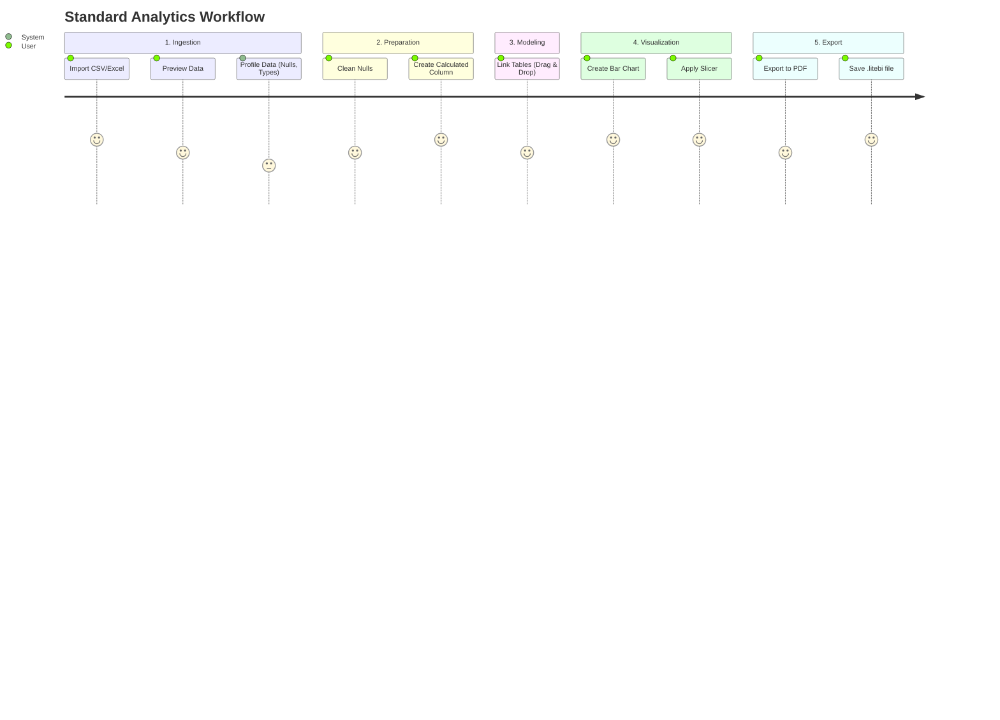

# Use Cases

This document describes the primary user flows and use cases within the LiteBI application.

## 1. End-to-End Analytics Flow

This is the primary happy path for a standard user.

## 2. Real-Time Collaboration Flow

How multiple users interact in a shared session.

1. **User A (Host):**
   - Clicks "Collaborate".
   - Generates a Room ID/Link.
   - Sends link to User B.
2. **User B (Guest):**
   - Opens link.
   - Local App requests same dataset import (to ensure data parity).
   - Joins WebRTC room.
3. **Synchronous Action:**
   - User A changes chart color to red.
   - System syncs `Y.Doc`.
   - User B sees the chart instantly turn red.
4. **Offline Resilience:**
   - User B loses internet.
   - User B continues editing offline.
   - User B regains internet. Yjs CRDTs automatically merge User B's offline edits with User A's recent edits.

## 3. Scheduled Background Refresh

Use case for users connecting to live databases (if implemented via Electron/Proxy).

1. **Setup:** User configures a PostgreSQL connection string.
2. **Schedule:** User sets refresh interval to "Every 5 minutes".
3. **Execution:** `DuckDBEngine` silently polls the Postgres DB in the background every 5 minutes.
4. **Update:** Data is fetched, aggregations are re-run, and the dashboard seamlessly updates without a full page reload.
